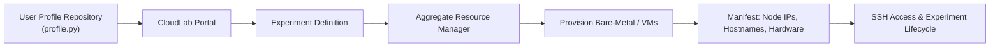

<!-- Top-right logo that follows the Material theme toggle (no JS) -->
<a class="brand-logos" href="https://terraform.io" title="Terraform">
  
  
</a>

# Welcome to the CloudLab Terraform Provider Docs

[](https://github.com/CSC478-WCU/terraform-provider-cloudlab/releases)
[](https://registry.terraform.io/providers/CSC478-WCU/cloudlab)

> **Developed by:** Tyler Geiger — West Chester University  
> **Special Thanks:** Dr. Linh Ngo  
> **Inspired by:** UCY-COAST — [github.com/ucy-coast/terraform-provider-cloudlab](https://github.com/ucy-coast/terraform-provider-cloudlab)

> ***Designed for educational and research use — not affiliated with the official CloudLab team.***

    


> 

---

## 1. What Is CloudLab?

[CloudLab](https://www.cloudlab.us) is an **academic testbed for cloud computing research** that provides access to **bare-metal and virtualized infrastructure** across multiple universities in the United States. It enables researchers to design, deploy, and experiment with full cloud systems—from hypervisors and storage layers to distributed applications—on isolated, dedicated hardware.

Unlike public cloud providers (AWS, Azure, GCP), CloudLab provides **root access** to both physical and virtual nodes, allowing deep system-level experimentation and network customization that commercial providers restrict.

CloudLab operates through **aggregates**, which are individual university sites such as:

- **Utah**
- **Wisconsin (Wisc)** 
- **Clemson**
- **UMass**
- **APT/Emulab**

Each aggregate exposes compute and networking resources through the **CloudLab Portal** and **XML-RPC API**, which serve as the main control interfaces for provisioning experiments.

---

## 2. What Is an Experiment?

An **experiment** in CloudLab is equivalent to a complete **custom cloud environment instance** — similar to an AWS VPC or Kubernetes cluster, but fully configurable from the hardware layer up.

Each experiment:

- Belongs to a specific **project** (your CloudLab organization).
- Is defined by a **profile** (a configuration template or topology generator).
- Is deployed to one or more **aggregates**.
- Contains one or more **nodes** (bare-metal or VM).
- Defines **links**, **LANs**, or **bridged links** for network topology.
- Produces an **RSpec** (Resource Specification XML) describing the entire infrastructure.

When launched, CloudLab clones the associated profile repository, executes its Python-based configuration script, generates an RSpec, and allocates resources. Once provisioning completes, the system returns a **manifest**, including node hostnames, IP addresses, and resource metadata.

---

## 3. What Is a Profile?

A **profile** is a reusable Python template that defines the structure and logic of an experiment. Profiles use the `geni.portal` and `geni.rspec.pg` libraries to programmatically describe nodes, networks, and storage.

For example:

```python
import geni.portal as portal
import geni.rspec.pg as RSpec

pc = portal.Context()
request = RSpec.Request()

node = request.RawPC("node1")
node.hardware_type = "d430"

pc.printRequestRSpec(request)
```

Profiles can:

- Accept **parameters** (e.g., node count, hardware type, image).
- Generate **dynamic RSpecs** programmatically.
- Execute **setup scripts** or clone Git repositories post-boot.
- Be reused or shared publicly through the CloudLab portal.

Each time a profile is instantiated, it launches a unique experiment derived from that topology.

---

## 4. How Experiments and Profiles Work Together



### 5. Experiment Lifecycle

1. **Create a Profile** – Define experiment topology in Python.
2. **Instantiate the Profile** – Launch via portal or Terraform provider.
3. **Provisioning Phase** – Allocates hardware, sets up networking, installs OS images.
4. **Experiment Ready** – Nodes are booted and accessible via SSH.
5. **Tear Down** – Terminate to release all allocated resources.

---

## 6. Why Use Terraform with CloudLab?

While CloudLab provides rich control through its web portal and XML-RPC API, it was not built for **automation** or **CI/CD workflows**.  
Typical workflows involve manual parameter inputs, ad hoc scripts, and limited reproducibility.

The **Terraform Provider for CloudLab** brings modern Infrastructure-as-Code (IaC) practices to this ecosystem by allowing you to:

- Version and reproduce experiments in Git.
- Automate provisioning with **CI/CD** pipelines (GitHub Actions, Jenkins, etc.).
- Programmatically create, monitor, and destroy experiments.
- Combine CloudLab with **Ansible**, **Helm**, and **Kubernetes** for hybrid deployments.
- Treat CloudLab as your **own private AWS region** for academic and research use.
  
---

> 2025 Tyler Geiger | CloudLab Terraform Provider Project  
> Designed for educational and research use — not affiliated with the official CloudLab team.
