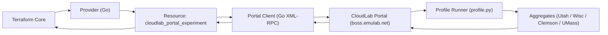
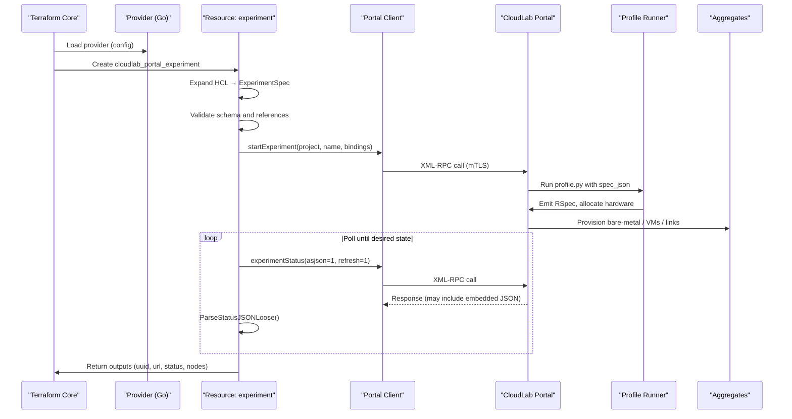
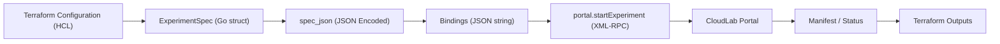
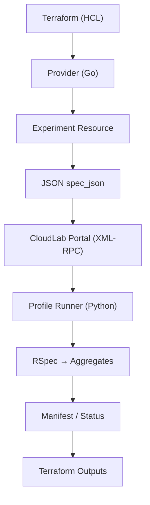

# Architecture / How It All Works

This section explains how the **CloudLab Terraform Provider** operates internally — from Terraform’s execution flow to CloudLab’s XML-RPC API, how data is serialized, and how statuses are polled and returned.

The goal is to help new contributors and maintainers understand the provider’s structure, lifecycle, and reasoning without overwhelming detail.

---

## High-Level Overview

The provider acts as a bridge between **Terraform Core** and the **CloudLab Portal**, allowing experiments to be created, monitored, and destroyed via Terraform.



!!! note
    The provider **never talks to aggregates directly**. All interactions go through the CloudLab Portal’s XML-RPC endpoint secured with mutual TLS (mTLS).

---

## Provider Composition (Go Packages)

| Package | Purpose |
|----------|----------|
| **cmd/terraform-provider-cloudlab/** | Plugin entry point (`main.go`). Registers the provider with Terraform. |
| **internal/provider/** | Defines provider configuration, schema, and diagnostics. |
| **internal/experiment/** | Implements the `cloudlab_portal_experiment` resource (CRUD lifecycle). |
| **internal/model/** | Typed Go structs for JSON experiment specs. |
| **internal/portalclient/** | XML-RPC client used to call CloudLab portal methods. |
| **internal/validation/** | Semantic checks (aggregate URNs, bounds, references). |

---

## Control Flow (Terraform Apply → Experiment)



---

## Lifecycle Summary

1. **Configure Provider** — Terraform reads credentials and portal connection info (`pem_path`, `project`, `server`, etc.).  
2. **Create Resource** — Provider encodes HCL into a JSON `spec_json`.  
3. **Launch Experiment** — Sends `startExperiment` with bindings containing the JSON spec.  
4. **Poll Status** — Periodically calls `experimentStatus` until the experiment reaches `wait_for_status`.  
5. **Read Outputs** — Provider flattens node/IP data and returns it as Terraform outputs.  
6. **Destroy Resource** — Calls `terminateExperiment` to tear down the experiment.

---

## Provider Data Flow



### 1. HCL → ExperimentSpec

The resource converts Terraform configuration blocks into a typed struct:

```go
type ExperimentSpec struct {
  Nodes []NodeSpec `json:"nodes"`
  Links []LinkSpec `json:"links,omitempty"`
}
```

### 2. JSON `spec_json`

That struct is serialized into JSON and embedded inside a “bindings” string:

```json
{
  "proj": "your-project",
  "profile": "your-project,terraform-profile",
  "name": "tf-demo",
  "bindings": "{\"spec_json\":\"{...escaped JSON...}\"}"
}
```

### 3. Profile Runner

The profile (`profile.py`) on CloudLab receives the bound `spec_json`, validates it, and emits a **RSpec XML** describing the experiment topology.

### 4. Portal Methods

| Method | Purpose |
|---------|----------|
| `portal.startExperiment` | Create a new experiment |
| `portal.experimentStatus` | Query status and aggregates |
| `portal.experimentManifests` | Retrieve node/IP manifest |
| `portal.terminateExperiment` | Destroy experiment |

---

## Status & Polling Logic

Status values follow CloudLab’s internal lifecycle:

`provisioning → provisioned → creating → created → booting → booted → ready`

Terraform waits for:

- `wait_for_status = "provisioned"` (default) → stops when resources allocated  
- `wait_for_status = "ready"` → deep check: every node and aggregate must be ready and have an IPv4 address

Polling uses a jitter-tolerant loop:

- Warm-up: 15 s  
- Interval: 10 s  
- Timeout: Provider-configurable (default 10 m)

---

## Error Handling

- **Portal Errors:** non-zero return codes bubble up with message and context.  
- **Status Parse Errors:** tolerant parser extracts the first valid JSON object from mixed output.  
- **Validation Errors:** semantic checks for duplicate names, invalid references, or out-of-range sizes.  
- **Timeouts:** gracefully aborts with actionable diagnostics.

Example diagnostic:

```
│ Error: cloudlab_portal_experiment.demo: portal.startExperiment failed (Code 3)
│ Output: invalid project identifier or certificate mismatch
```

---

## Security & Transport

- Mutual TLS (mTLS) using the user’s decrypted **PEM** for both key and certificate.  
- Default endpoint: `boss.emulab.net:3069` with path `/usr/testbed`.  
- Certificates are self-signed by CloudLab; the provider trusts them by default.  
- No credentials or PEMs are ever uploaded to Terraform Cloud or remote backends.

---

## Internal File Map

| Path | Purpose |
|------|----------|
| `cmd/terraform-provider-cloudlab/main.go` | Plugin entrypoint |
| `internal/provider/provider.go` | Provider registration and config schema |
| `internal/experiment/*` | Resource logic, HCL → JSON, polling, flattening |
| `internal/model/experiment.go` | Structs for JSON serialization |
| `internal/portalclient/*` | XML-RPC calls, TLS setup, error wrappers |
| `internal/validation/aggregates.go` | Valid aggregate URNs list |

---

## Why This Split Matters

Separating Terraform logic (Go) from CloudLab logic (Python `profile.py`) allows:

- **Stable provider API** — no RSpec parsing inside Go  
- **Profile flexibility** — experiment definitions evolve independently  
- **Simple contract** — one JSON blob (`spec_json`) defines everything

---

## Typical Contributor Workflow

1. Clone the repo and build locally:  
   ``go build -o terraform-provider-cloudlab ./cmd/terraform-provider-cloudlab``
2. Move the binary to your Terraform plugin directory.  
3. Run Terraform with debug logging:  
   ``TF_LOG=DEBUG terraform apply``
4. Modify `internal/experiment` logic or `portalclient` methods.  
5. Test against a personal CloudLab project.

---

### Quick Visual Recap



---

### In Summary

- **Terraform drives the lifecycle** (create, read, delete).  
- **The provider serializes infrastructure** into JSON.  
- **CloudLab’s Portal executes the profile** to produce an RSpec.  
- **Aggregates allocate and boot** the requested nodes.  
- **Terraform flattens outputs** (URL, UUID, status, node IPs).  

This architecture keeps the provider maintainable, secure, and fully aligned with standard Terraform practices while exposing the full power of CloudLab automation.
