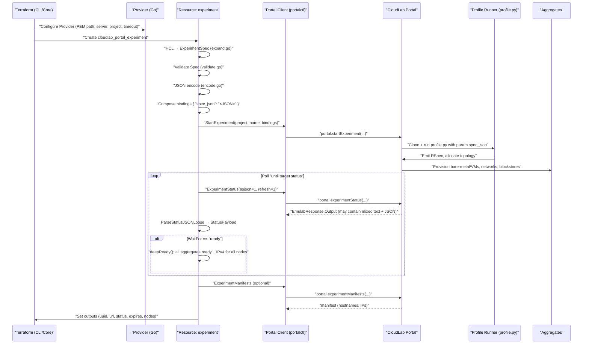

# Provider Internals — How It Works (Architecture & Flow)

> This page explains **how** the CloudLab Terraform Provider works under the hood — the components, data contracts, and the full control-flow from `terraform apply` to a ready experiment. This is **not** a usage guide; it’s a deep dive into the provider’s architecture.

---

## High-Level Architecture

```mermaid
flowchart LR
  TF["Terraform Core\n(terraform-plugin-sdk)"]
  P["Provider\ninternal/provider"]
  RES["Resource: cloudlab_portal_experiment\ninternal/experiment/*"]
  PC["Portal Client (Go)\nportalctl/portal (XML-RPC)"]
  CL["CloudLab Portal (XML-RPC)\nportal.* methods"]
  PR["Profile Repo (terraform-profile)\nprofile.py"]
  GEN["Profile Runner\n(geni.portal / RSpec)"]
  AGG["Aggregates\n(Utah / Wisc / Clemson / APT / UMass)"]
  MAN["Manifest + Status JSON\n(hosts, IPs, state)"]

  TF --> P --> RES --> PC --> CL --> PR --> GEN --> AGG --> MAN --> PC
  RES -->|"poll status"| PC
  PC -->|"return manifest/status"| RES --> TF
```



**Key ideas:**

* The **provider** never talks to aggregates directly; it only talks to the **CloudLab Portal** via **XML-RPC** (mutual-TLS).
* The provider sends a **single JSON “spec”** to the profile via **bindings**, and lets the **profile.py** generate the RSpec.
* Status/manifest are fetched back from the portal and **flattened into Terraform outputs**.

---

## Components Overview

<details>
<summary><strong>Components Overview</strong> — click to expand</summary>

### 1) Portal Client (Go) — `portalctl/portal`

* Thin, hardened XML-RPC wrapper with sensible TLS defaults and timeouts.
* Client certificate authentication (PEM) (self-signed expected by default).
* Exposes a small set of **high-level helpers** mapping to portal methods:

  * `portal.startExperiment`
  * `portal.experimentStatus`
  * `portal.terminateExperiment`
  * `portal.experimentManifests`
* Returns a typed `EmulabResponse { Code, Output, Value }`, and raises rich errors when `Code != 0`.


### 2) Terraform Provider — `internal/provider`

* Declares top-level provider configuration (project, PEM path, server/port/path, timeout).
* Creates a configured `portalclient.Client` (wrapping `portalctl/portal`) for resource packages.
* Uses `terraform-plugin-sdk/v2` and `terraform-plugin-log` for diagnostics & tracing.

### 3) Experiment Resource — `internal/experiment`

Responsible for turning Terraform HCL into the **single JSON “spec”** that the profile consumes, launching the experiment, **polling** for state, and **flattening** status back to Terraform outputs.

Subpackages/files of note:

* **`schema.go`** — Defines the HCL schema for:

  * `rawpc[]`, `xenvm[]`, `link[]`, `lan[]`, `bridged_link[]`
  * global fields like `name`, `project`, `pem_path`, `wait_for_status`
  * computed outputs: `uuid`, `url`, `status`, `expires`, `nodes{ name -> IPv4 }`

* **`expand.go`** — Converts HCL into `model.ExperimentSpec`:

  * Normalizes optional fields (pointers for optional ints/bools/floats)
  * Builds `Nodes[]`, `Links[]` (including bridged link QoS params)

* **`validate.go`** — Provider-side semantic checks before launch:

  * Unique node names, numeric bounds, valid references (e.g., `xenvm.instantiate_on` must point to a declared `rawpc`)
  * Blockstore presence and size ≥ 1
  * Optional aggregate URN must be recognized (see `internal/validation/aggregates.go`)

* **`encode.go`** — JSON encodes `ExperimentSpec` (this is the exact blob passed to the profile).

* **`compose.go`** — Wraps the spec JSON into portal “bindings” format and the required project/profile identifiers.

* **`resource.go`** — The lifecycle:

  1. **Create**:

     * Build + validate spec → JSON
     * Compose `startExperiment` params (project, experiment name, **bindings** with `spec_json`)
     * Call `portal.startExperiment`
     * **Poll** `portal.experimentStatus` until `wait_for_status` (defaults to `provisioned`, supports `ready`)

       * Polling uses `helper/retry.StateChangeConf`, with warmup and jitter-immune loops
       * Parses **JSON embedded in mixed output** via a tolerant extractor (`ParseStatusJSONLoose`)
  2. **Read**:

     * Fetch current status → flatten nodes/IPv4 → set outputs (`uuid`, `url`, `expires`, `status`, `nodes`)
  3. **Delete**:

     * Call `portal.terminateExperiment` and clear state

* **`wait.go`** — Status predicate logic:

  * Statuses are **ranked** and normalized (e.g., `started`, `running` fold into the booted bucket).
  * If waiting for **`ready`**, uses a **deep check**:

    * Overall status == `ready`
    * Every aggregate status == `ready`
    * Every node has a non-empty IPv4

* **`flatten.go`** — Flattens status payload into Terraform schema (especially `nodes{}` map).

### 4) Profile Runner — `terraform-profile/profile.py`

* A **strict gateway** between “whatever Terraform describes” and a valid **RSpec**.
* Accepts one parameter: `spec_json` (string).
* If empty, emits a trivial single-node RSpec; otherwise:

  * **Parses JSON**, performs **robust schema and semantic validation** (e.g., kind is `rawpc` or `xenvm`, links reference existing nodes, numeric normalization, blockstore size canonicalization to `NNGB`).
  * Generates an RSpec using `geni.portal`, `geni.rspec.pg`, `geni.rspec.igext`, `geni.rspec.emulab`.
  * Supports:

    * `rawpc` nodes (hardware type, exclusive mode, image, aggregate URN, routable control IP)
    * `xenvm` nodes (cores/ram/disk, InstantiateOn -> rawpc, image, aggregate, routable IP)
    * Blockstores (names, mount points, normalized sizes)
    * Links/LANs/Bridged Links (with optional bandwidth/latency/plr on bridged links)

When CloudLab launches, it clones this profile into its runner, passes the bound `spec_json`, **prints RSpec**, and the portal allocates resources accordingly.

</details>

---

## Control Flow (Step-by-Step)

<details>
<summary><strong>Control Flow (Step-by-Step)</strong> — expand to view sequence</summary>



</details>

---

## Data Contracts

<details>
<summary><strong>Bindings & Spec (what the provider sends)</strong></summary>

### 1) **Bindings** sent to `portal.startExperiment`

Provider composes bindings as **JSON string** (per portal API requirement):

```json
{
  "spec_json": "{ \"nodes\": [ ... ], \"links\": [ ... ] }"
}
```

Wrapped inside the `startExperiment` call:

```json
{
  "proj":    "<project>",
  "profile": "cloud-edu,terraform-profile",
  "name":    "<experiment-name>",
  "bindings": "{\"spec_json\":\"...<escaped JSON>...\"}"
}
```

> The **profile name** is fixed in the provider (`cloud-edu,terraform-profile`) and maps to the repository that contains `profile.py`.

### 2) **Experiment Spec** (provider → profile)

What Terraform constructs and encodes (see `internal/model/experiment.go`):

```json
{
  "nodes": [
    {
      "kind": "rawpc",
      "name": "n1",
      "hardware_type": "d430",
      "exclusive": true,
      "disk_image": "urn:...",
      "aggregate": "urn:publicid:IDN+apt.emulab.net+authority+cm",
      "routable_ip": true,
      "blockstores": [
        { "name": "bs0", "mount": "/var/lib/bs0", "size": 200 }
      ]
    },
    {
      "kind": "xenvm",
      "name": "vm1",
      "cores": 4,
      "ram": 8192,
      "disk": 50,
      "instantiate_on": "n1",
      "disk_image": "urn:...",
      "aggregate": "urn:...",
      "routable_ip": false
    }
  ],
  "links": [
    {
      "kind": "link",
      "name": "l01",
      "interfaces": [
        { "node": "n1", "ifname": "eth1" },
        { "node": "vm1", "ifname": "eth0" }
      ]
    },
    {
      "kind": "bridged_link",
      "name": "wan",
      "bandwidth": 1000,
      "latency": 20,
      "plr": 0.001,
      "interfaces": [
        { "node": "n1" },
        { "node": "vm1" }
      ]
    }
  ]
}
```

> The **profile** normalizes sizes (e.g., blockstore `200` → `"200GB"`), enforces kinds (`rawpc`/`xenvm`), and validates link references before emitting the RSpec.

### 3) **Status & Manifest** (portal → provider)

* `portal.experimentStatus` returns human text that **may include** a JSON object; the provider extracts the **first top-level JSON** via `ParseStatusJSONLoose`.
* Parsed payload includes:

  * Overall `Status` (e.g., `provisioned`, `booted`, `ready`)
  * `AggregateStatus[]` (per-site states)
  * Node inventory (flattened to names/IPs in outputs)

</details>

---

## Status Model & Waiting Logic

### Canonical order (lowest → highest)

`provisioning` → `provisioned` → `creating` → `created` → `booting` → `booted` → **`ready`**

**Wait modes:**

* `wait_for_status = "provisioned"` (default): succeed when current rank ≥ `provisioned`.
* `wait_for_status = "ready"`: require **deepReady**: overall == `ready`, every aggregate == `ready`, **every node has IPv4**.

Polling:

* Warmup delay: ~15s
* Poll interval: ~10s
* Timeout: provider `timeout` (default 10m) or resource create timeout.

---

## Security & Transport

* **Mutual TLS** using the user’s **CloudLab PEM** for both `CertPEM` and `KeyPEM`.
* Default server: `boss.emulab.net:3069`, path `/usr/testbed` *(configurable if later changed - shouldn't ever need to touch).*

---

## Error Handling

* **Portal call errors** (`Code != 0`) bubble up with rich context (code, output, value).
* **Status parsing** is tolerant: if JSON is embedded inside mixed output, `ParseStatusJSONLoose` scans for the first valid top-level object.
* **Validation** fails early with actionable messages (e.g., unknown node reference in a link, invalid aggregate URN, blockstore size < 1).
* **Read** if the experiment is gone, the resource state is cleared.

---

## File Map (for maintainers)

* `cmd/terraform-provider-cloudlab/main.go` — plugin entrypoint
* `internal/provider/provider.go` — provider config/bootstrap
* `internal/experiment/*` — resource schema, HCL→spec expansion, validation, compose/encode, wait/poll, flatten, CRUD
* `internal/model/experiment.go` — JSON spec structs
* `internal/portalclient/*` — thin wrapper re-exporting `portalctl/portal` client, options, helpers, loose parser
* `internal/validation/aggregates.go` — known aggregate URNs
* **External**:

  * `github.com/csc478-wcu/portalctl` — XML-RPC client + types
  * `github.com/csc478-wcu/terraform-profile` — `profile.py` (geni.portal → RSpec)

---

## Why This Split (Provider ↔ Profile) Matters

* Keeps Terraform provider **small and stable**: no RSpec logic in-provider.
* The **profile** can evolve independently (new node kinds, link types, storage settings) without a provider release.
* The **contract** is a single JSON spec (`spec_json`) — clear, testable, and versionable.

---

## Glossary of Portal Methods (used)

* `portal.startExperiment(proj, profile, name, bindings)`
* `portal.experimentStatus(experiment, asjson?, withcert?, refresh?)`

  * Provider passes `experiment="<project>,<name>"` (comma form).
* `portal.experimentManifests(experiment)`
* `portal.terminateExperiment(experiment)`

---

## Notes on Defaults

* **Profile name** (in provider): `cloud-edu,terraform-profile`
* **Wait target**: `provisioned` (override with `wait_for_status = "ready"`)
* **Timeouts**: Provider default `10m` (configurable)
* **PEM path**: Default `~/cloudlab.pem` (configurable via provider or resource)

---

> *2025 Tyler Geiger — CloudLab Terraform Provider Project. 
> Designed for educational and research use; not affiliated with the official CloudLab team.*
