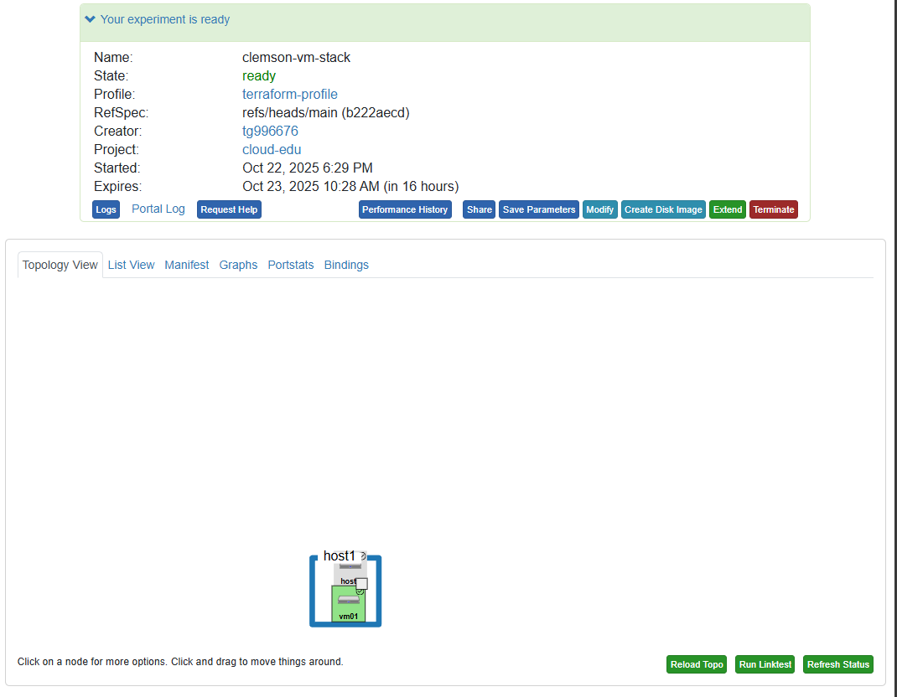

# Usage Guide

This page is the authoritative reference for defining CloudLab experiments with Terraform using this provider.  
If you haven’t deployed your first experiment yet, start with [Getting Started](getting-started.md).  
If you’re new to Terraform, read [What Is Terraform](what-is-terraform.md).

---

## Resource: ``cloudlab_portal_experiment``

The resource schema below mirrors the provider’s implementation.

### Top-Level Arguments

| Field | Type | Required | ForceNew | Description |
|---|---|---:|:---:|---|
| ``name`` | string | ✓ | ✓ | Experiment name. |
| ``project`` | string |  | ✓ | CloudLab project; defaults to provider value if set. |
| ``pem_path`` | string |  | ✓ | Path to CloudLab PEM for mTLS to the Portal. |
| ``wait_for_status`` | string |  | ✓ | Target state: ``"provisioned"`` (default) or ``"ready"``. |
| ``rawpc`` | list(object) |  | ✓ | Bare-metal nodes. See **RawPC**. |
| ``xenvm`` | list(object) |  | ✓ | Xen VMs. See **XenVM**. |
| ``link`` | list(object) |  | ✓ | Point-to-point links (exactly 2 interfaces). |
| ``lan`` | list(object) |  | ✓ | Broadcast networks (2+ interfaces). |
| ``bridged_link`` | list(object) |  | ✓ | Links with optional QoS (bandwidth/latency/PLR). |

**Validation:**
- ``wait_for_status`` ∈ {``"provisioned"``, ``"ready"``}.
- All topology blocks are **ForceNew** (changes will recreate the experiment).

---

## Computed Outputs

| Field | Type | Description |
|---|---|---|
| ``uuid`` | string | Experiment UUID. |
| ``url`` | string | Experiment portal URL. |
| ``status`` | string | Current lifecycle status. |
| ``expires`` | string | Expiration timestamp (portal time). |
| ``nodes`` | map(string) | Node name → IPv4 control address. |

---

## Nested Object Schemas

### RawPC (Bare-Metal)

```hcl
rawpc {
  name          = "node0"                       # required
  hardware_type = "d430"                        # optional example (Emulab)
  exclusive     = true                          # optional
  disk_image    = "urn:publicid:IDN+emulab.net+image+Ubuntu22-64-STD" # optional
  aggregate     = "urn:publicid:IDN+emulab.net+authority+cm"          # optional
  routable_ip   = true                          # optional

  blockstore {
    name    = "bs0"       # required
    mount   = "/data"     # optional
    size_gb = 100         # required (int)
  }
}
```

**Fields:**  
- ``name`` (string, required)  
- ``hardware_type`` (string)  
- ``exclusive`` (bool)  
- ``disk_image`` (string)  
- ``aggregate`` (string)  
- ``routable_ip`` (bool)  
- ``blockstore`` (list of **Blockstore**)

---

### XenVM (Virtual Machine)


```hcl
xenvm {
  name           = "vm01"        # required
  cores          = 4             # optional (int)
  ram_mb         = 8192          # optional (int)
  disk_gb        = 50            # optional (int)
  instantiate_on = "node0"       # must match a RawPC name
  disk_image     = "urn:publicid:IDN+emulab.net+image+Ubuntu22-64-STD"
  aggregate      = "urn:publicid:IDN+apt.emulab.net+authority+cm"
  routable_ip    = false

  blockstore {
    name    = "vmdata"
    mount   = "/var/lib/vmdata"
    size_gb = 50
  }
}
```

**Fields:**  
- ``name`` (string, required)  
- ``cores`` (int)  
- ``ram_mb`` (int)  
- ``disk_gb`` (int)  
- ``instantiate_on`` (string) — must reference a declared **RawPC** ``name``  
- ``disk_image`` (string)  
- ``aggregate`` (string)  
- ``routable_ip`` (bool)  
- ``blockstore`` (list of **Blockstore**)

---

### Blockstore

> Used under both ``rawpc`` and ``xenvm``.

```hcl
blockstore {
  name    = "bs0"           # required
  mount   = "/data"         # optional
  size_gb = 200             # required (int)
}
```

**Fields:**  
- ``name`` (string, required)  
- ``mount`` (string)  
- ``size_gb`` (int, required)

---

### Interfaces (Shared Sub-object)

Used in ``link``, ``lan``, and ``bridged_link``.

```hcl
interface {
  node   = "node0"
  ifname = "eth1"       # optional
}

interface {
  node = "node1"
}
```

**Fields:**  
- ``node`` (string, required) — must match a declared ``rawpc.name`` or ``xenvm.name``  
- ``ifname`` (string, optional)

---

### Link (Point-to-Point)

> **Exactly two** interfaces; enforced by ``MinItems: 2, MaxItems: 2``.

```hcl
link {
  name = "l01"

  interface { node = "node0"; ifname = "eth1" }
  interface { node = "node1"; ifname = "eth1" }
}
```

**Fields:**  
- ``name`` (string, required)  
- ``interface`` (list, required, **2 exactly**)

---

### LAN (Broadcast Segment)

> **Two or more** interfaces; ``MinItems: 2``.

```hcl
lan {
  name = "lan0"

  interface { node = "node0"; ifname = "eth1" }
  interface { node = "node1"; ifname = "eth1" }
  interface { node = "node2" }
}
```

**Fields:**  
- ``name`` (string, required)  
- ``interface`` (list, required, **≥ 2**)

---

### Bridged Link (QoS)

> Same interface rules as LAN (≥ 2). Optional QoS knobs.

```hcl
bridged_link {
  name           = "wan"
  bandwidth_mbps = 1000
  latency_ms     = 20
  plr            = 0.001

  interface { node = "node0" }
  interface { node = "node1" }
}
```

**Fields:**  
- ``name`` (string, required)  
- ``bandwidth_mbps`` (int, optional)  
- ``latency_ms`` (int, optional)  
- ``plr`` (float, optional)  
- ``interface`` (list, required, **≥ 2**)

---

## End-to-End Examples 

### 1) Single Bare-Metal Node (Minimal)

=== "Terraform Code"
    ```hcl
    resource "cloudlab_portal_experiment" "apt_demo" {
        name            = "apt-demo"
        project         = "your-project"
        wait_for_status = "provisioned"

        rawpc {
            name          = "node0"
            hardware_type = "r320"
            exclusive     = true
            aggregate     = "urn:publicid:IDN+apt.emulab.net+authority+cm"
            routable_ip   = true
        }
    }
    ```

=== "Result" 
    
---

### 2) Two Nodes + Point-to-Point Link

=== "Terraform Code"

    ```hcl
    resource "cloudlab_portal_experiment" "emulab_cluster" {
        name            = "emulab-two-node"
        project         = "your-project"
        wait_for_status = "ready"

        rawpc {
            name          = "n1"
            hardware_type = "d430"
            exclusive     = true
            aggregate     = "urn:publicid:IDN+emulab.net+authority+cm"
        }

        rawpc {
            name          = "n2"
            hardware_type = "d430"
            exclusive     = true
            aggregate     = "urn:publicid:IDN+emulab.net+authority+cm"
        }

        link {
            name = "l01"
            interface {
                node   = "n1"
                ifname = "eth1"
            }
            interface {
                node   = "n2"
                ifname = "eth1"
            }
        } 
    }
    ```

=== "Result"
    


---

### 3) Host RawPC + XenVM + Blockstore + Bridged WAN

=== "Terraform Code"
    ```hcl
    resource "cloudlab_portal_experiment" "clemson_vm_stack" {
        name            = "clemson-vm-stack"
        project         = "your-project"
        wait_for_status = "ready"

        # Host on Clemson
        rawpc {
            name          = "host1"
            hardware_type = "c6320"
            exclusive     = true
            aggregate     = "urn:publicid:IDN+clemson.cloudlab.us+authority+cm"

            blockstore {
                name    = "hostdata"
                mount   = "/mnt/hostdata"
                size_gb = 200
            }
        }

        # Guest VM on the same host/aggregate
        xenvm {
            name           = "vm01"
            instantiate_on = "host1"
            cores          = 4
            ram_mb         = 8192
            disk_gb        = 50
            routable_ip    = true
            aggregate      = "urn:publicid:IDN+clemson.cloudlab.us+authority+cm"

            blockstore {
                name    = "vmdata"
                mount   = "/var/lib/vmdata"
                size_gb = 50
            }
        }

        # Plain point-to-point link 
        link {
            name = "l01"
            interface {
                node   = "host1"
                ifname = "eth1"
            }
            interface {
                node   = "vm01"
                ifname = "eth1"
            }
        }
    }
    ```
=== "Result" 
    
---

## Outputs Usage

```hcl
output "experiment_url" { value = cloudlab_portal_experiment.vm_stack.url }
output "nodes"          { value = cloudlab_portal_experiment.vm_stack.nodes }
output "status"         { value = cloudlab_portal_experiment.vm_stack.status }
output "uuid"           { value = cloudlab_portal_experiment.vm_stack.uuid }
```

Example CLI:

```bash
terraform output experiment_url
terraform output -json nodes
```

---

## Behavior Notes

- ``ForceNew`` on topology blocks means edits recreate the experiment (CloudLab cannot in-place mutate most topology).  
- Use ``wait_for_status = "provisioned"`` during iteration to shorten feedback loops; switch to ``"ready"`` for CI or when you need IPv4s for every node.  
- ``instantiate_on`` must reference an existing RawPC ``name``.  
- Interface ``node`` values must match declared ``rawpc`` or ``xenvm`` names.

---

## Debugging

Enable verbose logs:

```bash
TF_LOG=DEBUG terraform apply
```

Portal errors are surfaced verbatim with context when XML-RPC calls fail (e.g., certificate mismatch, invalid project, unavailable image).
